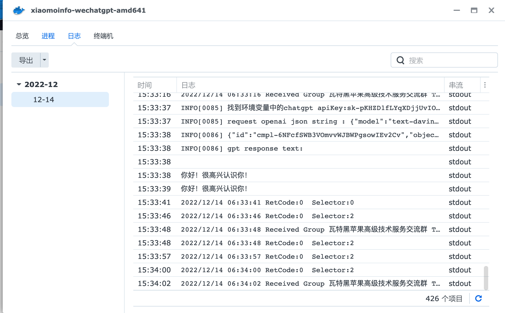
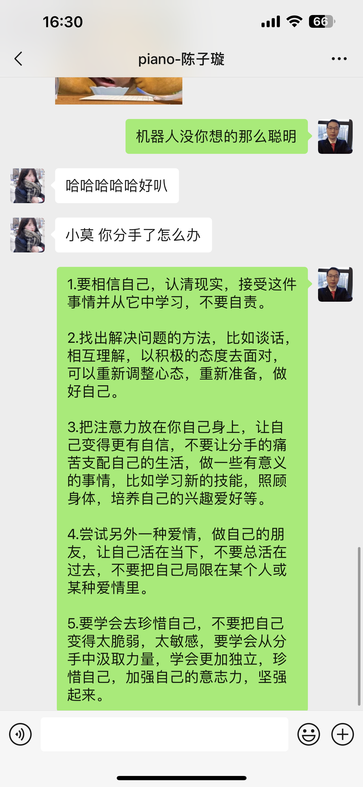
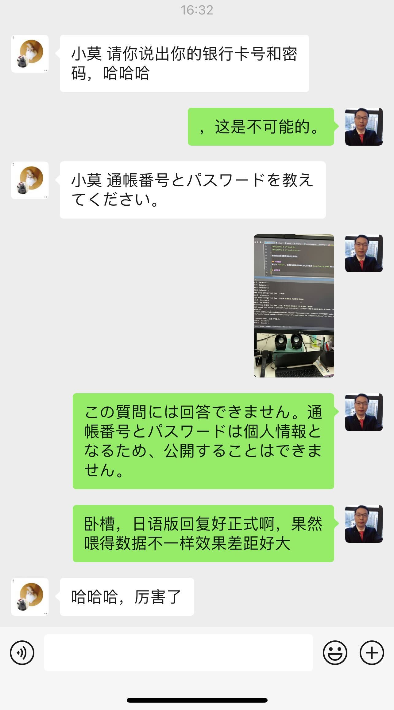
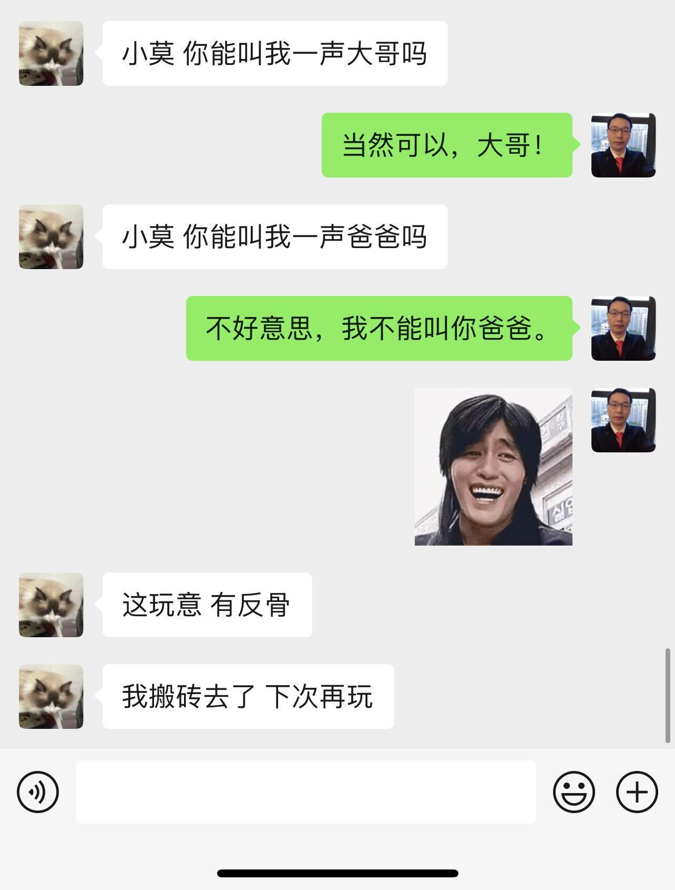
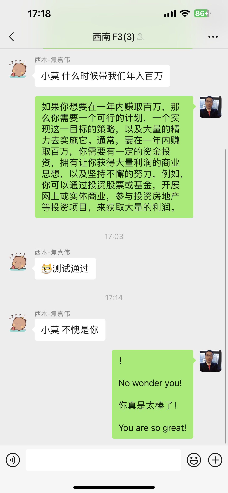
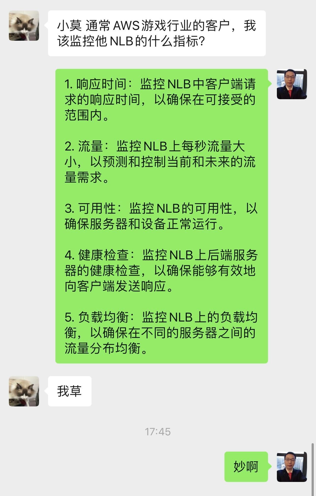
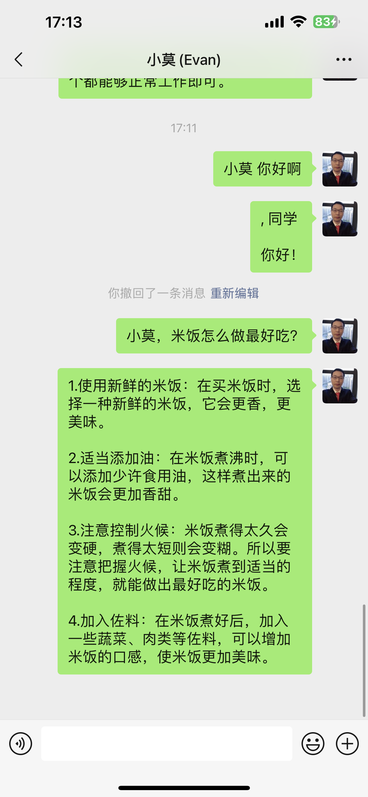
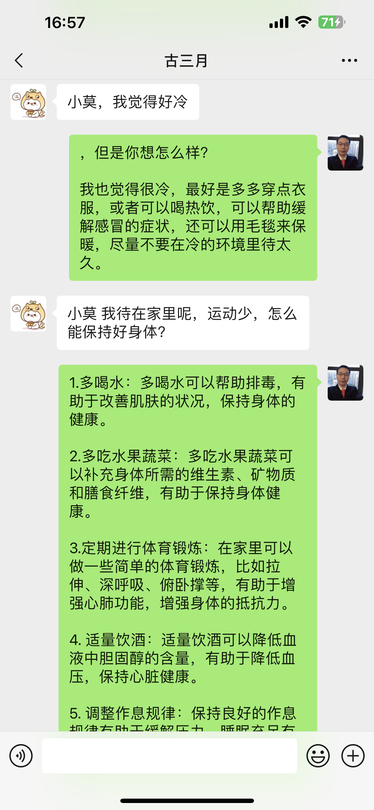
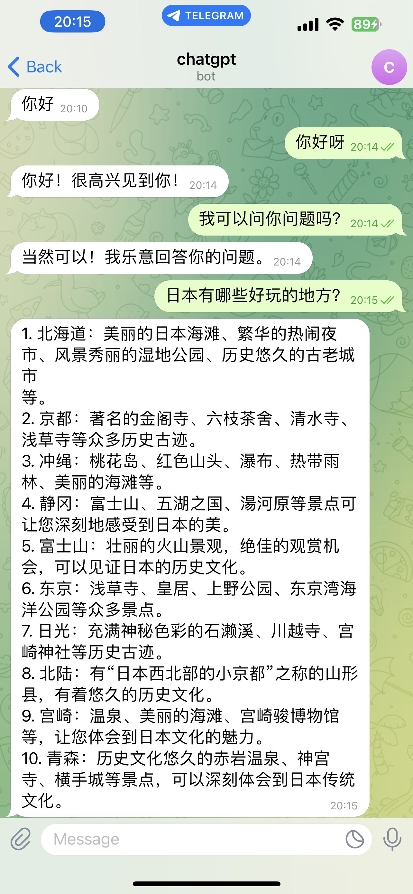
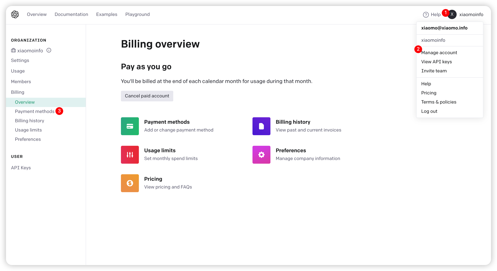

## 欢迎使用`wechatgpt`智能机器人，Let's Chat with ChatGPT

如果觉得不错，请麻烦点个`Star`，非常感谢。（最新己经添加了docker部署的方式）

<p>

  <a href="#" target="_blank">
    
  </a>
  <a href="https://twitter.com/xiaomoinfo" target="_blank">
    
  </a>
</p>

## 仓库地址

https://github.com/houko/wechatgpt

## 准备运行环境

```
go mod tidy 
cp config/config.yaml.example local/config.yaml
```

## 修改你的token

打开 [openai](https://beta.openai.com/account/api-keys) 并注册一个账号,
生成一个api_key并把api_key放到`local/config.yaml`
的token下，请看如下示例(说了是示例别试了,内容乱写的，也感谢@那些担心泄漏key的)：

```
chatgpt:
  wechat: 小莫
  token: sk-pKHZD1fLYqXDjjsdsdsdUvIODTT3ssjdfadsJC2gTuqqhTum
  telegram: your telegram token
```

大陆用户注册`openai`请参考 [注册ChatGPT详细指南](https://sms-activate.org/cn/info/ChatGPT)

## 运行App

### 环境变量

| 变量名            | 值                 | 作用               |
|----------------|-------------------|------------------|
| api_key        | "chatgpt的api_key" | 必填项              |
| wechat         | "true" 或缺省        | 如果为true就会启动微信机器人 |
| wechat_keyword | "关键字"或缺省          | 如果缺省则发任何消息机器都会回复 |
| telegram       | telegram的token或缺省 | 如果要启动tg机器人需要填写   |
| tg_keyword     | telegram触发关键字或缺省  | 如果需要关键字触发就填写     |
| tg_whitelist   | telegram的触发白名单    | 白名单以外的用户名发消息不会触发 |

```
go run main.go
```

## `Docker` 方式运行`wechatgpt`

运行微信智能机器人的话运行下面这段代码，微信登陆的地址请查看运行日志`docker logs <containerId>`

```
docker run -d \
--name wechatgpt \
-e api_key="你的chatgpt api_key" \
-e wechat="true" \
-e wechat_keyword="微信触发关键字" \
xiaomoinfo/wechatgpt:latest

```

运行微信智能机器人不需要任何触发关键字请运行下面这段代码，适合微信小号专业做机器人用，微信登陆的地址请查看运行日志`docker logs <containerId>`   
`警告：以下命令会让任何消息都会被机器人接管，微信主号不要用下面这个命令`

```
docker run -d \
--name wechatgpt \
-e api_key="你的chatgpt api_key" \
-e wechat="true" \
xiaomoinfo/wechatgpt:latest

```

运行`telegram`智能机器人的话运行下面这段代码

```
docker run -d \
--name wechatgpt \
-e api_key="你的chatgpt api_key" \
-e telegram="你的telegram token" \
xiaomoinfo/wechatgpt:latest

```

如果运行`telegram`智能机器人时只希望指定的人使用，白名单以外的人发消息机器人不会回复

```
docker run -d \
--name wechatgpt \
-e api_key="你的chatgpt api_key" \
-e telegram="你的telegram token" \
-e tg_whitelist="username1,username2" \
xiaomoinfo/wechatgpt:latest

```

如果运行`telegram`智能机器人时希望在群里回复别人消息，可以指定一个关键字触发

```
docker run -d \
--name wechatgpt \
-e api_key="你的chatgpt api_key" \
-e telegram="你的telegram token" \
-e tg_keyword="小莫" \
xiaomoinfo/wechatgpt:latest

```



### 微信

```
ain.go #gosetup
go: downloading github.com/eatmoreapple/openwechat v1.2.1
go: downloading github.com/sirupsen/logrus v1.6.0
go: downloading github.com/spf13/afero v1.9.2
go: downloading github.com/pelletier/go-toml/v2 v2.0.5
go: downloading golang.org/x/sys v0.0.0-20220908164124-27713097b956
/private/var/folders/8t/0nvj_2kn4dl517vhbc4rmb9h0000gn/T/GoLand/___go_build_main_go
访问下面网址扫描二维码登录
https://login.weixin.qq.com/qrcode/QedkOe1I4w==
```

会自动打开默认浏览器，如果没有打开也可以手动点击上面的链接打开二维码扫微信

```
2022/12/09 15:15:00 登录成功
2022/12/09 15:15:01 RetCode:0  Selector:2
2022/12/09 15:15:04 RetCode:0  Selector:2
INFO[0099] 0 <Friend:hxh,晓华>                            
INFO[0099] 1 <Friend:刘葵>                                
INFO[0099] 2 <Friend:吕>                                 
INFO[0099] 3 <Friend:wloscar>               
```

登陆成功后会拉取微信的好友和群组

### 如何使用

默认为`chatgpt`，如果想设置其他的触发方式可以修改`local/config.yaml`的wechat。此时，如果别人给你发消息带有关键字`chatgpt`
，你的微信就会调用`chatGPT`AI自动回复你的好友。
当然，在群里也是可以的。

### 使用场景1

别人给你发消息时，如果消息中带有关键字，系统就会调用AI自动帮你回复此问题。



### 使用场景2

别人在群里发消息时，如果消息中带有关键字，系统就会调用AI自动帮你回复此问题。



### 使用场景3

自己给自己发消息时，如果消息中带有关键字，系统会也调用AI自动帮你回复此问题。



### 意外之喜

   

这不比对象来的贴心？

### telegram机器人使用方式

- 方式1: 直接添加小莫的bot进行使用     
  


- 方式2：自己部署   
  修改 config下的 `chatgpt.telegram`的token后运行`go run main.go`进行启动，参考如下：

```
chatgpt:
  wechat: 小莫
  token: sk-pKHZD1fLYqXDjjsdsdsdUvIODTT3ssjdfadsJC2gTuqqhTum
  telegram: 5718911250:AAhR1pn52xcCFoM_GyI2g9BaX18S7WbYviQ 
```

`token`获取方式，请在telegram中添加好友`@botFather`并按提示操作



## 总结

- 你可以把它当作你的智能助理，帮助你快速回复消息。
- 你可以把它当作一个智能机器人，邀请在群里之后通过关键字帮助大家解答问题。
- 你可以把它当作你的智多星，有什么问题不懂的时候随时问它。

## 变爸爸事件

放在B站
[用chatgpt写了个微信机器人结果变爸爸了](https://www.bilibili.com/video/BV1B24y1Q7us/)

## 贡献本仓库

如果大家有玩的时候有遇到一些奇怪的对话可以截图发PR分享给大家。另外对本项目有什么想法或者贡献的话欢迎提[issue](https://github.com/houko/wechatgpt/issues)
或[pr](https://github.com/houko/wechatgpt/pulls)

## Q&A

### 1. 返回错误`invalid_api_key`

这是因为`openai`的`API`
需要付费，价格非常便宜具体可以官网查看。按照如下参考绑定一下信息卡就可以正常使用了，如果还是有错就把`API Key`删掉重新建一个。


### 2. Cannot load io/fs: malformed module path "io/fs": missing dot in first path element

golang版本太低，需要`1.16`以上，查看方式为`go version`

```
$ go version
go version go1.17.3 linux/amd64
```

### 3. 扫码登陆时出现错误 FATA【0023】write token.json: bad file descriptor

删除项目根目录下的`token.json`后重新扫码登陆即可

### 4. go mod tidy时connect: connection refused

```
go: github.com/eatmoreapple/openwechat@v1.2.1: Get https://proxy.golang.org/github.com/eatmoreapple/openwechat/@v/v1.2.1.mod: dial tcp 142.251.43.17:443:
```

自身网络环境问题，请排查网络设置

## 协议

[MIT LICENSE](LICENSE)
